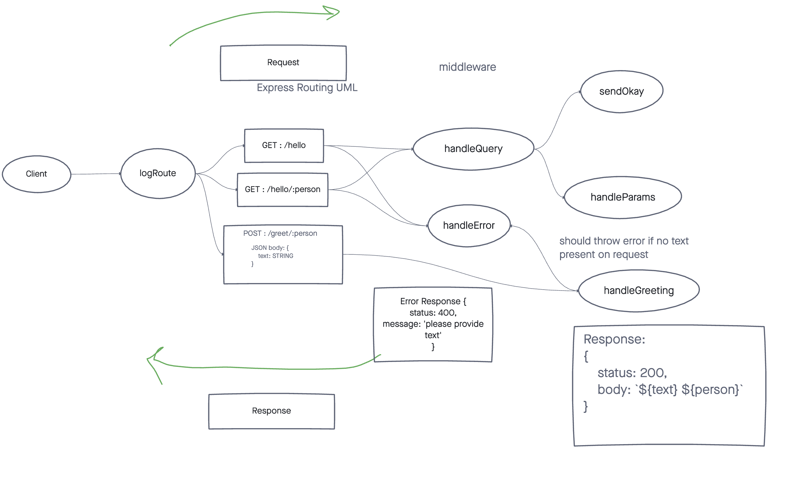

# Useless Api

A useless HTTP server for demonstration purposes.

Deployed links:
- https://<my-app-name>.herokuapp.com

## Installation

1. Clone from this repo `git clone <REPO_URL_HERE`
1. cd into <REPO_NAME>
1. `npm install`

## Usage

Once installed, run `npm start`

## Contributors / Authors

- Jacob Knaack
- JS 401 d46 class.

## Features / Routes

- POST : `/greet/:person`
  - Parameters
    - must include a person as a route parameter.
    - must include a text property on the request body.
  - Response
    - status 200, and string body if parameters look good.
      - body: `TEXT PERSON`
    - status 400, if no text is present.
