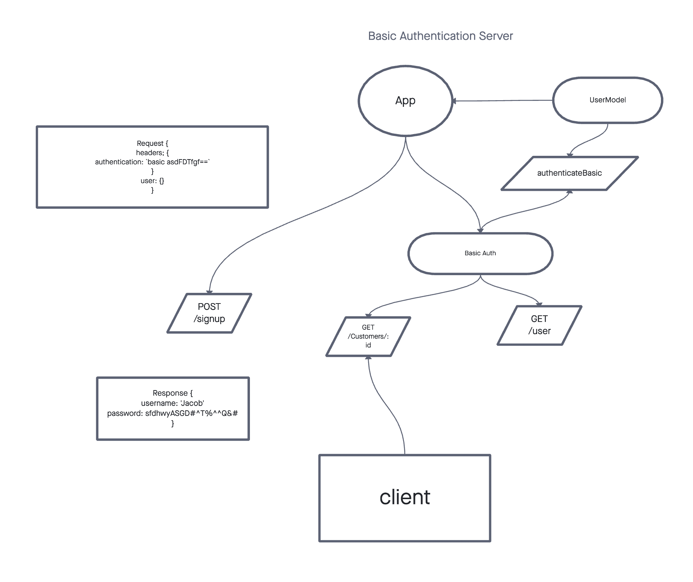

# Class 06: Authentication

## Announcements

- Where we've been:
  - Node / Node Modules?
    - A file / or a bit of code that we can run in node.
    - How do we import Node Modules?
      - we use built in function - `require`.
  - Express
    - Routing
      - endpoint / path
        - Params: requirments for hitting a specific middleware. GET -> `http://localhost:3000/users/Jacob`
      - HTTP method
    - Middleware - a callback function that you provide to tell it what to do when you receive a request.
  - CRUD with Sequelize
    - Model - Database schema, defines columns through types.

      ```javascript
      // creates tables Users
      sequelize.define('Users', {
        // columns
      });
      ```

  - RESTful routing.

    - The way we map our HTTP methods.
    - GET / POST / PUT / PATCH / DELETE -> CRUD
      - GET -> READ
      - POST -> CREATE
      - PUT / PATCH -> UPDATE
      - DELETE -> DELETE
    - http method: `GET` -> request endpoint or path `/users`
      - Rey: path contians the resource we want to perform CRUD on.

- where we are going: Authentication

  - => Who are you?
  - How do we know who is trying to make this request.
  - Basic Auth (usernames and passwords).

- All labs have starter Code.

## Warm Up

We covered Linked Lists: Linear Sequence of Nodes.

- Come up with 1 or 2 tests that you could use to validate that a linked list can add nodes.

## Encoding Vs Encryption

- Encoding: using a standardized communication method.
  - base64: 'Hello I am Jacob!! nice to meet you" => `asdf2654gfcxd`
- Encryption: Hiding information from everyone
  - Can only be decryption or parsed, using a "key".
  - bcrypt!

## Basic Authentication

1. Create a route to `register` / `signup`. takes in a username and password as a JSON body.
1. Immediately encrypt password, and store in User table.

1. Encode basic authentication credentials (username and password) and attach to a header via base 64.
1. Read the auth header and decode momentarily.
1. Use Sequelize to find a user by the provided username.
   1. if found, use bcrypt to compare password from header, with encrypted password stored in DB.
1. If comparison returns true, the request is validated.
   1. if not return a 401 Unauthorized status.

## TDD: Basic Auth Router



POST => `http://localhost:3000/signup`

GET / POST / PUT / DELETE  => `http://localhost:3000/users`
 - return 401 if unathenticated.
