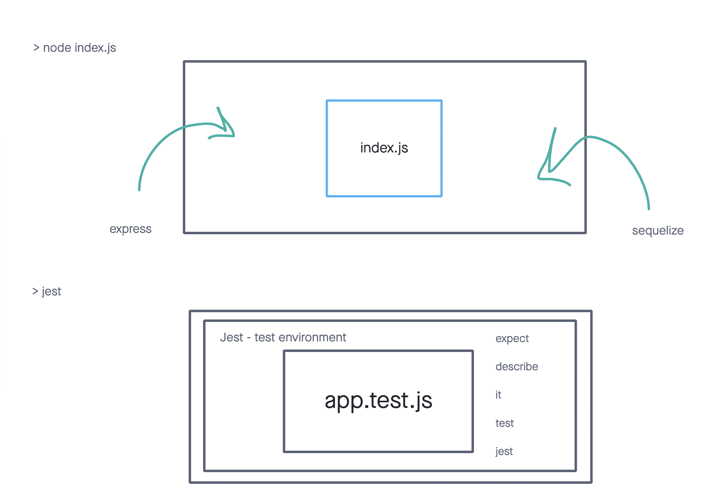

# Class 09: Final Auth / Auth

## Warm Up

See warm Up folder

## Review

* REST APIs + Auth
* Micha: test suites are still having issues running in order.
* Andres: --runInBand seems to help get tests running consistantly.
  * Running test statements in the order that they are written in the document.
  * unhandled promise exceptions causing an issue.
* Andres: deploying to heroku for different environments.
  * Check for the logs for specifics error.
  * `heroku logs --tail`
* Jeffrey: Bearer Auth, other forms of jwt security.
  * Adding an array into the user table.
    * This should be possible.
  * Store that as a string, and JSON.parse / JSON.stringify.

## Final Auth Lab

Ya'll will pair up and build your own solution to a problem domain of your choosing.

## Jest API

Integration Test vs Unit Tests

* Intgration tests focus on integrating modules and libraries to produce specific behavior
* Unit test only test the code you write.
  * Out of scope: other code modules and libraries.

### Runtime Environments

Node > Jest

