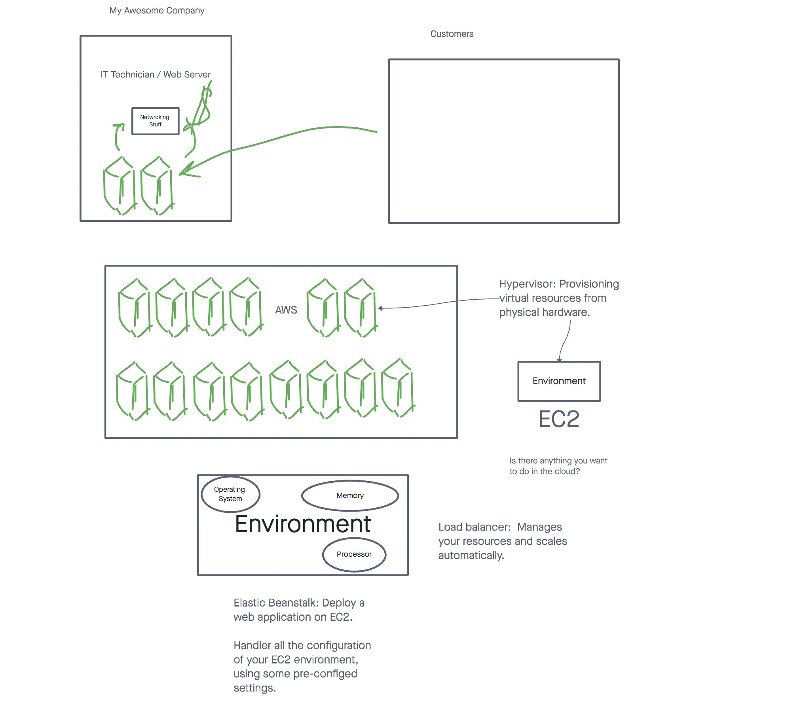

# Class 16: AWS Intro

## Presentations: Final Event Lab

Dragon Group: chit-chat

- Event Pool: join / send / leave.
- Client side HTML connects to the server and send message payload to a Room.

Caps Quiz: Number guessing game.

- Event Pool: gamestart / guess / results.
- Multiple conditions to win (closest number / exact number).
- Client side done through a terminal CLI!

DungeonIO : text based dungeon crawler.

- Event Pool: join /ready/ encounter / choice / resolution.
- Uses CLI commands / keywords to offer user capabilities.

Where we've been:

- RESTful HTTP web services with Express and Node.
- Database management with Sequelize.
- Authentication and Authorization with and Access Control List (ACL)
- Event Drive programs with the Observer pattern.

## Cloud Computing

Maybe 10 years ago, few companies proabbly used cloud computing products but instead used Physical servers in their offices.

## AWS Tour

- Dashboard
- Cost Explorer
- Budget tool

### EC2 (Elastic Compute)

Virtual Environments running on Physical Server Farm hardware.

- Create a virtual machine by provisioning resources from physical servers.  Very fast and efficient, sit in between the Operating System and the underlying hardware.  Allows seemless scalabilty between softeware and hardware.
- Environments can be accessible to other Amazon Services and the public.

### Elastic Beanstalk (Appliction platform)

Web Application Platform on top of EC2 Virtual environments.

- Create a platform specific runtime application that can execute your source code.
- Configres an EC2 instance, preconfigured with the scale and maintain tools for your application type.
