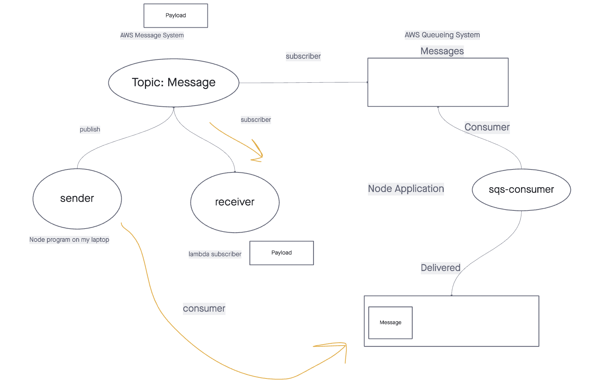

# Class 19: SNS and SQS

## Announcement

- Project week kicks off tomorrow!
* Peoject teams announced tomorrow as well.

## Review

API Gateway / DynamoDB Lambda functions

- Use dynamoose in a lambda function.
- Gateway route to Lambda.

### Code Challenge (k-ary tree)

See review folder.

## Event Driven Systems (Observer Pattern) on AWS

- EventPool: `pickup` / `delivered` / `in-transit` / `received`.
  - Observable - object / things that a client can subcribe / publish to.
  - Publishers to `pickup` (vendor)
  - Subscribers to `pickup` (driver)
  - Publishers of `delivered` (Driver)
  - Subscribers of `delivered` (Vendor)
  - Subscriber of `received` (vendor / driver)
  - Publisher of `received` (vendor / driver)

### SNS

AWS uses "topic" as an observable that can be published or subscribed by clients.

### SQS

If you have a Fifo Queue subscribed to a topic, that topic must also be a Fifo topic.
